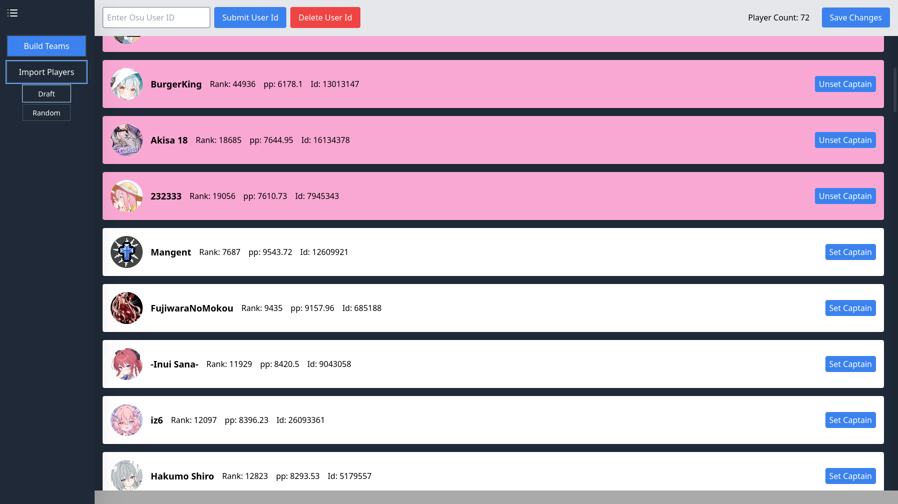
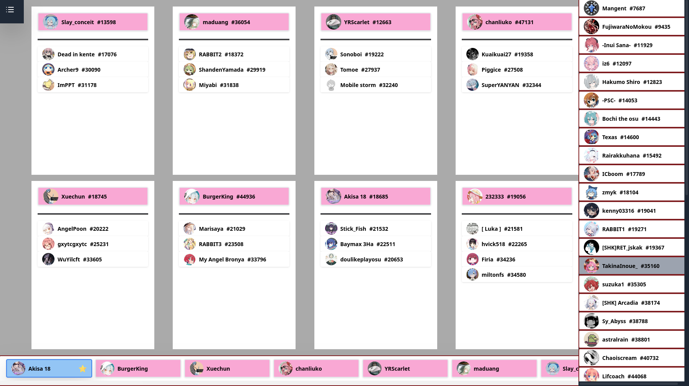

# Osu Draft Teamizer

An interface written in Svelte for drafting/building tournament teams in the game OSU!.

## Try it out:
https://osu-draft-teamizer-bf3981i97-li05js-projects.vercel.app/

## Features

- [Upload user info through OSU! API, stored in local storage]
- [Set captain, bind players, all in a simple few clicks]
- [An interactive interface to showcase the team building procecss]

## Screenshots
  
  

### Requirements

- Node.js (v20)
- npm
- SvelteKit (Svelte 5)

### Install & Run

```bash
git clone https://github.com/Li05j/osu-draft-teamizer.git
cd your-repo
npm install
npm run dev
